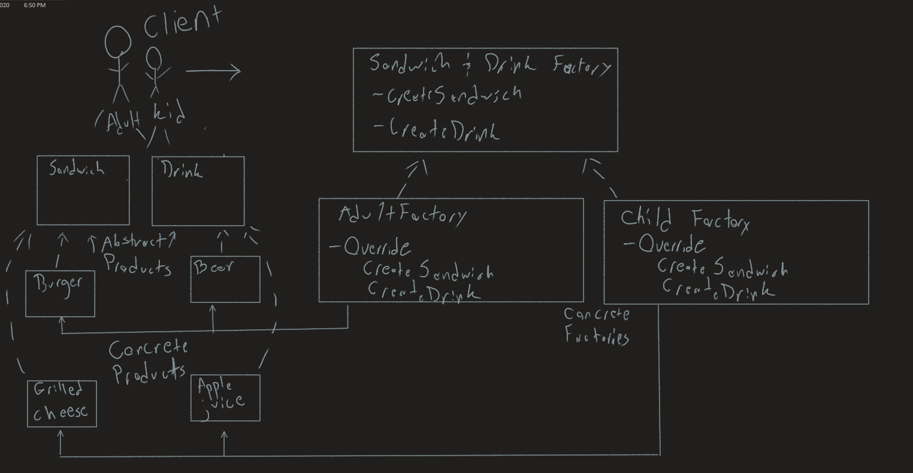
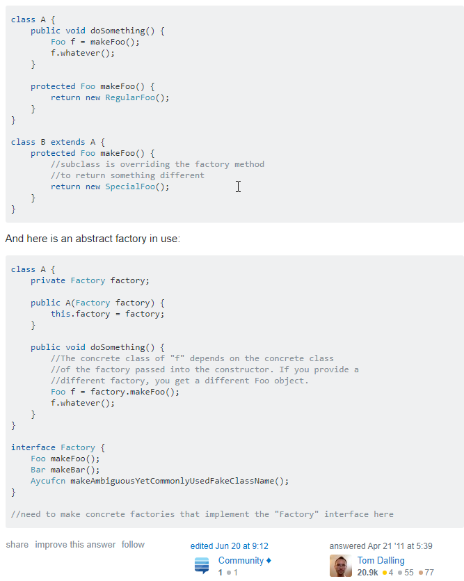

# Abstract Factory Example

This console app was made to showcase a basic real-world type example of the use for the Abstract Factory design pattern.

Example was adapted from: https://www.exceptionnotfound.net/abstract-factory-pattern-in-csharp/

Author: *Nicco Ryan*

## Factory Method Vs. Abstract Factory

